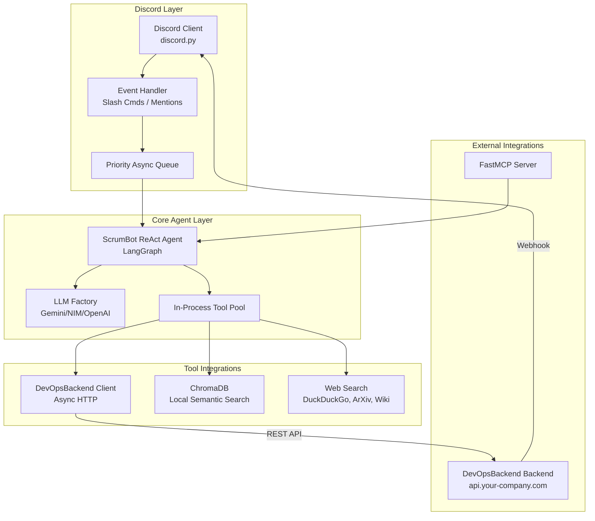

# AI ScrumBot


**CustomOrg AI ScrumBot** is a next-generation, low-latency AI Scrum Master built specifically for Discord and native integration with the **DevOpsBackend DevOps Board**.

Inspired by the original [ScrumAgent](https://github.com/Shikenso-Analytics/ScrumAgent), this rewrite completely overhauls the architecture to eliminate blocking bottlenecks, reduce latency by up to 6x, and expose the bot's capabilities as a standard MCP (Model Context Protocol) server.

---

## ✨ Why is this better?

* **⚡ Ultra-Low Latency:** Moved Chroma vector search and API clients in-process. No more waiting 5–15 seconds for `stdio` subprocesses to spin up on every request.
* **🔄 Fully Asynchronous:** Built from the ground up with Python's `asyncio` and `httpx.AsyncClient`. Long-running LLM inferences no longer block the Discord event loop.
* **🛠️ First-Class DevOpsBackend Integration:** Reads and writes directly to your CustomOrg DevOps board (Epics, Features, User Stories, Tasks) via REST API and Webhooks—replacing the heavy reliance on Taiga.
* **🤖 Universal LLM Support:** Easily swap between OpenAI, Anthropic, Gemini, Ollama, and NVIDIA NIM using the flexible `llm.py` factory.
* **🎮 True Discord UX:** Ditches clunky text commands for modern Discord UI features: Slash Commands (`/board`, `/standup`, `/task update`), rich embeds, and interactive buttons.
* **🔌 MCP Server Mode:** Exposes the ScrumBot itself as an MCP server. Other AI tools and agents can query your board's status or search Discord history.

---

## 🏗️ Architecture



---

## 🚀 Getting Started

### 1. Prerequisites

- Python 3.10 to 3.12
* Node.js (for the DevOpsBackend backend)
* PostgreSQL (DevOpsBackend Database)

### 2. Installation

Clone the repository and install the dependencies using `pip` (or `uv` / `hatch`):

```bash
git clone https://github.com/your-org/AI_ScrumBot.git
cd AI_ScrumBot

# Install dependencies
pip install -e .
```

### 3. Configuration

Copy the `.env.example` to `.env` and fill in your keys:

```bash
cp .env.example .env
```

**Key Variables:**

* `SCRUM_AGENT_MODEL`: Choose your LLM (e.g., `gemini-1.5-pro`, `gpt-4o`, `meta/llama-3.1-70b-instruct`)
* `DISCORD_TOKEN`: Your Discord Bot token
* `DEVOPS_API_URL`: Your DevOpsBackend API endpoint (`https://api.your-company.com/api`)
* `BOT_API_KEY`: The API key matching your DevOpsBackend backend middleware

### 4. DevOpsBackend Setup

Run the seed script on your DevOpsBackend backend to create the dedicated Bot Admin user:

```bash
cd ../DevOpsBackend/backend
node scripts/seedBotUser.js
```

---

## 💻 Usage

The bot features a unified entry point that can run the Discord bot, the MCP server, or both simultaneously.

**Run the Discord Bot (Default):**

```bash
python main.py --mode discord
```

**Run as a standalone MCP Server:**

```bash
python main.py --mode mcp
```

**Run Both (Discord + MCP):**

```bash
python main.py --mode both
```

---

## 🎮 Discord Slash Commands

| Command | Description |
| :--- | :--- |
| `/board` | Generates a rich embed overview of the current DevOpsBackend DevOps board. |
| `/standup` | Manually triggers a daily standup thread for the current channel. |
| `/task create <title>` | Creates a new Task under a specified User Story. |
| `/task update <id> <status>` | Updates the status of a specific task (e.g., Pending -> In Progress). |
| `/ask <query>` | Asks the AI Scrum Master a natural language question about the project. |
| `/sync` | Forces a manual two-way sync between Discord discussions and DevOpsBackend. |
| `/epic list` | Lists all active Epics and their current risk/priority status. |

---

## 📂 Project Structure

* **`main.py`**: The CLI entry point.
* **`scrumbot/agent.py`**: The core LangGraph ReAct agent loop.
* **`scrumbot/discord/`**: Discord UI, views, embeds, slash commands, and background schedulers.
* **`scrumbot/custom_backend/`**: The async HTTP client and LangChain tools for interacting with the CustomOrg DevOps board.
* **`scrumbot/data/`**: In-process ChromaDB vector store and Discord message collectors.
* **`scrumbot/mcp_server/`**: Exports the bot's internal capabilities as an external MCP server.

---

## 📝 License

This project is licensed under the MIT License.
