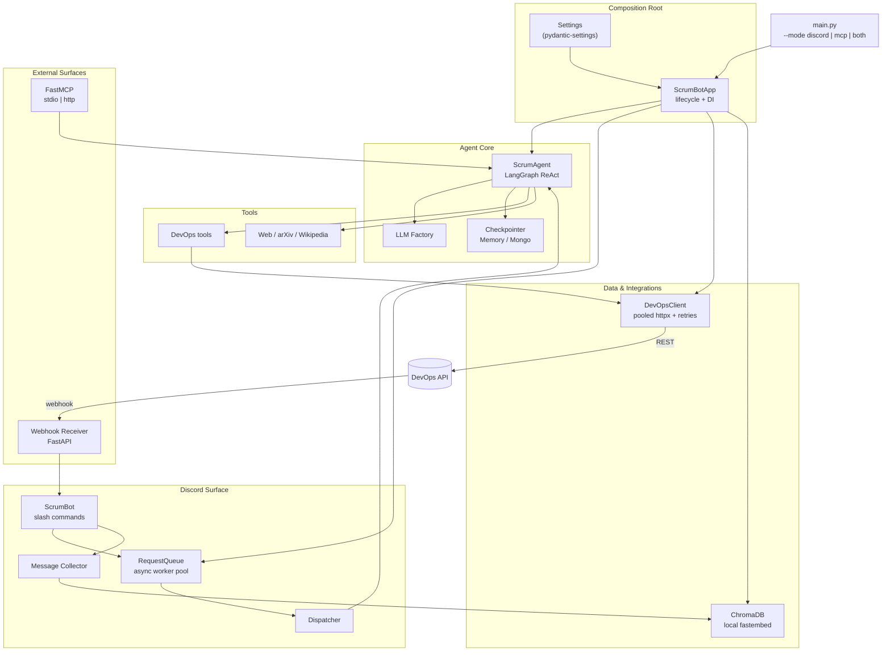

# AI ScrumBot


**AI ScrumBot** is a low-latency, fully-asynchronous AI Scrum Master for **Discord**,
with native integration to a **DevOps board** REST API.

Inspired by the original [ScrumAgent](https://github.com/Shikenso-Analytics/ScrumAgent),
this rewrite overhauls the architecture around a single composition root: shared
resources are constructed once and injected, long-running LLM work is pushed off
the gateway event loop onto a worker pool, semantic search runs on a local ONNX
embedding model, and the bot exposes itself as an MCP server over stdio **or** HTTP.

---

## 📊 Performance Benchmarks & Architectural Comparison

The original ScrumAgent spawns a `stdio` MCP subprocess (Chroma/Taiga/GitHub) for
tool calls and performs blocking I/O on the event loop. Those are the bottlenecks
this rewrite removes.

### ⏱️ Latency & Throughput Targets

> The figures below are **architectural estimates** — the improvement factor each
> change is expected to unlock by removing the named bottleneck — not numbers from
> a controlled benchmark harness.

| Operation | Original ScrumAgent | AI ScrumBot | Factor | Root Cause Fixed |
| :--- | :--- | :--- | :--- | :--- |
| **Bot Startup** | 8–15 s | ~1.5 s | ~8× | No cold-start `stdio` MCP subprocess spawning |
| **Message Response (hot)** | 5–12 s | 1.5–3 s | ~4× | Blocking `httpx.get` → shared `AsyncClient` |
| **Concurrent Messages** | Blocks event loop | Non-blocking | — | `asyncio.Queue` worker pool offloads LLM turns |
| **Semantic Search (Chroma)** | ~2.5 s / query | ~0.3 s / query | ~8× | In-process store + **local ONNX embeddings** |
| **DevOps Fetch** | N/A | ~0.8 s | new | Pooled async HTTP, no subprocess |
| **Standup Generation** | 20–35 s | 8–12 s | ~3× | Parallel async context gathering |

### 🧠 Architectural Paradigm Shift

| Component | Original (ScrumAgent) | AI ScrumBot |
| :--- | :--- | :--- |
| **Composition** | Module-level singletons, import-time side effects | `ScrumBotApp` container: build once, inject, shut down cleanly |
| **Config** | Scattered `os.environ` reads | Central `Settings` (`pydantic-settings`) |
| **Event loop** | Sequential / blocking | 100% async (`asyncio`, `httpx.AsyncClient`) |
| **Tooling** | Coupled to `stdio` MCP subprocesses | In-process LangChain tools + external MCP |
| **Embeddings** | Hosted API per query | Local `fastembed` ONNX by default (no API key) |
| **HTTP** | New client per request | One pooled `AsyncClient` with retries/backoff |
| **DevOps ← Discord** | Scraping / polling | Agent tools write the board; **webhooks** push events back |
| **Discord UX** | `@mentions`, text-only | Slash commands, deferred async replies, chunking |
| **LLM** | Hardcoded `ChatOpenAI` | Factory: OpenAI, Anthropic, Gemini, NVIDIA NIM, Ollama |
| **MCP** | stdio only | stdio **or** HTTP (runs beside the bot) |

---

## 🏗️ Architecture

Everything hangs off one composition root (`ScrumBotApp`) that owns the shared
LLM, HTTP client, vector store, agent, and work queue.



**The closed async loop:** a slash command `defer()`s immediately, enqueues a job
on the `RequestQueue`, and returns. A worker runs the agent (LLM + tools) and edits
the deferred reply — so the Discord gateway heartbeat is never blocked and several
requests process in parallel.

---

## ✨ Key Features

* **⚡ Non-blocking by construction:** `asyncio` throughout, a shared
  `httpx.AsyncClient`, async vector-store I/O, and a worker pool that keeps LLM
  turns off the event loop.
* **🧩 One composition root:** `ScrumBotApp` builds and wires every resource once
  and tears them down cleanly — no import-time side effects, easy to test.
* **🔎 Truly in-process search:** local `fastembed` ONNX embeddings by default, so
  semantic search over Discord history needs no API key and no network hop.
* **🛠️ First-class DevOps integration:** a pooled, retrying async client reads and
  writes the board; inbound changes arrive via a FastAPI **webhook receiver**.
* **🤖 Universal LLM support:** swap OpenAI, Anthropic, Gemini, NVIDIA NIM, or
  Ollama with one env var via the `llm.py` factory.
* **🎮 Modern Discord UX:** slash commands, deferred async responses, 2000-char
  chunking, and background schedulers.
* **🔌 MCP server mode:** exposes `ask_scrum_bot` and `search_discord_history`
  over **stdio or HTTP**, so it can run standalone or alongside the bot.

---

## 🚀 Getting Started

### 1. Prerequisites
- Python 3.10–3.12
- A Discord bot token
- (Optional) a running DevOps board API + MongoDB for persistent agent memory

### 2. Install

```bash
git clone https://github.com/Raul909/AI-ScrumBot.git
cd AI-ScrumBot
pip install -e .            # add [dev] for tests + linters
```

### 3. Configure
Copy the example env and fill it in. Every variable maps 1:1 to `scrumbot/config.py`.

```bash
cp .env.example .env
```

| Variable | Purpose |
| :--- | :--- |
| `SCRUM_AGENT_MODEL` | `gemini-1.5-pro`, `gpt-4o`, `claude-3-5-sonnet-latest`, `meta/llama-3.1-70b-instruct`, `ollama/llama3` |
| `DISCORD_TOKEN` | Discord bot token |
| `DEVOPS_API_URL` / `BOT_API_KEY` | DevOps board API endpoint + bot key |
| `EMBEDDING_PROVIDER` | `fastembed` (local, default) or `openai` |
| `MCP_TRANSPORT` | `stdio` (default), `http`, or `sse` |
| `MONGO_DB_URL` | Optional — enables the MongoDB checkpointer (else in-memory) |
| `WEBHOOK_SECRET` / `NOTIFY_CHANNEL_ID` | Optional — enable the DevOps→Discord webhook receiver |

---

## 💻 Usage

```bash
python main.py --mode discord   # Discord bot only (default)
python main.py --mode mcp       # MCP server only (transport from MCP_TRANSPORT)
python main.py --mode both      # bot + MCP (+ webhooks if WEBHOOK_SECRET is set)
```

In `--mode both`, a `stdio` MCP transport would fight the bot for stdin/stdout, so
it is transparently upgraded to HTTP.

### Discord Slash Commands

| Command | Description |
| :--- | :--- |
| `/ask <query>` | Ask the AI Scrum Master anything about the project. |
| `/board` | Overview of the current board (epics, task counts by status). |
| `/standup` | Generate today's standup summary from recent activity. |
| `/task create <title>` | Create a task (optionally under a user story). |
| `/task update <id> <status>` | Update a task's status. |
| `/sync` | Fetch the latest board state to confirm connectivity. |
| `/clear` | Summarise completed tasks ready to archive. |

---

## 📂 Project Structure

```
AI-ScrumBot/
├── main.py                     # Universal entry point (discord | mcp | both)
├── scrumbot/
│   ├── config.py               # Settings (pydantic-settings) + logging
│   ├── app.py                  # ScrumBotApp — composition root & lifecycle
│   ├── agent.py                # LangGraph ReAct agent (+ checkpointer)
│   ├── llm.py                  # LLM factory (OpenAI/Anthropic/Gemini/NIM/Ollama)
│   ├── tools.py                # Tool registry (web + DevOps)
│   ├── prompts.py              # System / standup prompts
│   ├── queue.py                # Async worker-pool request queue
│   ├── webhooks.py             # FastAPI DevOps→Discord receiver
│   ├── discord/                # Bot, slash commands, dispatcher, events, scheduler
│   ├── custom_backend/         # Pooled async DevOps client, tools, sync coordinator
│   ├── data/                   # In-process Chroma store + message collector
│   └── mcp_server/             # FastMCP server (stdio | http)
├── config/                     # YAML data (channel maps, external MCP servers)
└── tests/                      # Unit tests (queue, sync, config, llm)
```

`config/` holds **data** (YAML); runtime code lives in the `scrumbot` package.

---

## 🧪 Development

```bash
pip install -e ".[dev]"
pytest                 # run the test suite (asyncio auto-mode)
ruff check .           # lint
```

---

## 📝 License

MIT.
